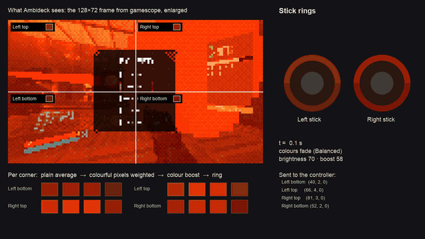

# Ambideck

A [Decky Loader](https://decky.xyz) plugin that turns the ROG Xbox Ally's stick lights into an Ambilight: while
you play, each half of each ring takes the colour of its corner of the screen.



## What it does

- **Follows the screen** in any game: four corners (top and bottom half of each ring), or one colour per side.
- **Keeps colours alive:** colourful pixels count more than grey ones, so pastel and dark scenes keep their tint,
  and a dark scene still leaves a faint glow.
- **Hands the lights back** when you stop playing: to [HueSync](https://github.com/honjow/HueSync)'s setting if
  you use it, otherwise to the controller's rainbow.
- **Per game:** switch it off for games where it distracts.
- **Outside games:** off, your normal lights, or the colours of a game page's artwork.
- **Docked:** off by default; one switch to keep it on.
- **Light on resources:** gamescope hands over a tiny 128×72 frame; about 7 % of one CPU core in total.

## Install

Ambideck is not in the Decky plugin store. In Game Mode:

1. Decky → Settings → General → turn on **Developer mode**.
2. Download `ambideck.zip` from the [latest release](../../releases/latest).
3. Decky → Settings → Developer → **Install plugin from ZIP**.

## Settings

Quick Access (…) → Ambideck: on/off, **In this game**, **Layout** (Corners or Sides), **Brightness**,
**Colour boost**, **Speed** (Smooth, Balanced, Fast), **Outside games** and **Run when docked**.

## How it works

The animation above is a real capture from the device, run through Ambideck's own colour code:

1. gamescope (Steam's compositor) shrinks every frame to 128×72 on the GPU and hands it over through PipeWire.
2. The frame is split into four corners, one per half ring, and every 4th pixel of each corner is read.
3. Colourful pixels are weighted more than grey ones, then the colour boost raises the saturation.
4. The ring's brightness follows the corner's brightness, with a small minimum glow.
5. Colours fade smoothly between frames and jump on scene cuts, then go to the controller with the same HID
   message the kernel driver uses.

When Ambideck takes over, it asks HueSync to step aside; when it stops, it asks HueSync to re-apply your setting
for the current game and power state. Both go through HueSync's own backend, and no HueSync code is copied.

## Compatibility

Tested on a ROG Xbox Ally (RC73YA) running Bazzite, handheld and docked to a TV. The original Ally and Ally X use
the same driver and should work, but their zone order is untested. Other handhelds are not supported: the panel
says so and Ambideck does nothing.

## Development

```bash
pnpm install
pnpm test
python3 -m venv .venv && .venv/bin/pip install pytest && .venv/bin/pytest tests/py
python3 scripts/make_vectors.py   # after changing the colour maths (keeps Python and TypeScript in step)
scripts/package.sh                # builds out/ambideck.zip
```

`scripts/serve.sh` serves the zip on your network for **Install plugin from URL**.
`scripts/demo-capture.py` and `scripts/demo-render.py` make the animation above.
[docs/device-checklist.md](docs/device-checklist.md) lists what to check on the device.

## About this project

A personal project, maintained on a best-effort basis. The code was written with [Claude](https://claude.ai)
(Anthropic's AI), directed, reviewed and tested on device by the author.

## Credits

- ROG Ally light protocol as documented by [HHD](https://github.com/hhd-dev/hhd) and the Linux `hid-asus-ally`
  driver (Luke D. Jones, Denis Benato).
- Works alongside [HueSync](https://github.com/honjow/HueSync) by honjow through its public backend methods.
- Demo footage: ULTRAKILL by Arsi "Hakita" Patala / New Blood Interactive.
- Not affiliated with ASUS, Microsoft, Valve, Philips or any game shown.

## License

[MIT](LICENSE)
